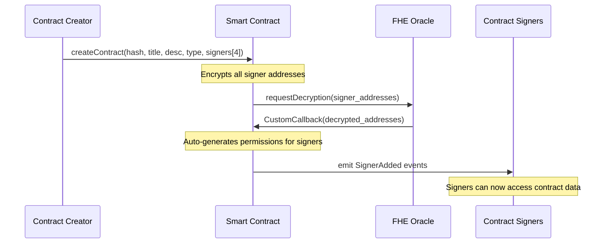
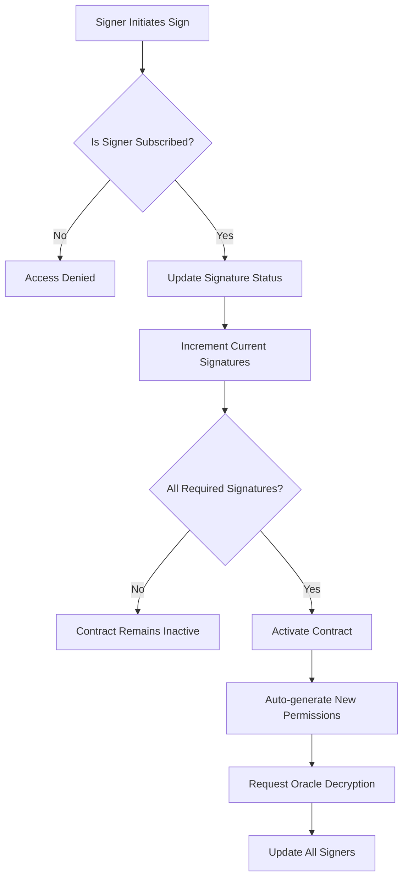
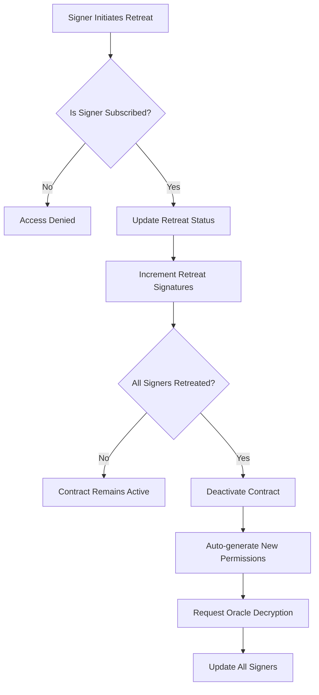
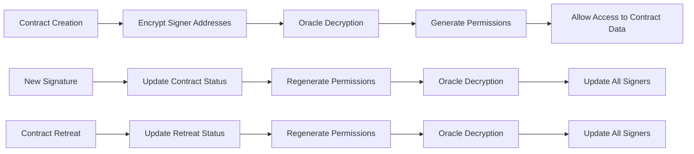

<div align="center">

# 🔐 **GBury - FHE Enterprises Contracts**

### _Revolutionary Privacy-Preserving Contract Management_

[](https://soliditylang.org/)
[](https://hardhat.org/)
[](https://docs.zama.ai/fhevm)
[](LICENSE)

_Fully Homomorphic Encryption for Enterprise Contract Management_

---

</div>

## Project Purpose and Description

**FHE Enterprises Contracts** is a revolutionary blockchain-based contract management system that leverages Fully
Homomorphic Encryption (FHE) to provide complete privacy and security for enterprise contract workflows. This project
enables businesses to create, manage, and execute contracts with multiple signers while maintaining full confidentiality of contract data and signer information.

The system uses Zama's FHEVM technology to ensure that all sensitive contract data, including signer addresses,
signatures, and contract status, remains encrypted throughout the entire lifecycle while still allowing for secure
contract execution and validation.

## 🚀 Live Contract Deployment

<div align="center">

### **FHE Enterprises Contracts - Sepolia Testnet**

[](https://sepolia.etherscan.io/address/0x13034f18EEa44430Dd9184F78358A9eEb58C6955#code)
[](https://sepolia.etherscan.io/)
[](https://docs.zama.ai/fhevm)

**Contract Address:** `0x13034f18EEa44430Dd9184F78358A9eEb58C6955`

[**🔍 View on Etherscan**](https://sepolia.etherscan.io/address/0x13034f18EEa44430Dd9184F78358A9eEb58C6955#code) |
[**📊 Contract Analytics**](https://sepolia.etherscan.io/address/0x13034f18EEa44430Dd9184F78358A9eEb58C6955#readContract)

</div>

---

## Key Features

- 🔐 **Full Encryption**: All contract data and signer information is encrypted using FHE
- 👥 **Multi-Signer Support**: Support for up to 4 signers per contract
- ⚡ **Real-time Updates**: Automatic permission management and status updates
- 🛡️ **Privacy-Preserving**: Signers can only access contracts they're subscribed to
- 🔄 **Flexible Workflow**: Support for both contract activation and deactivation
- 🌐 **Sepolia Testnet Ready**: Deployed and tested on Sepolia testnet

## Application Flow

### 1. Contract Creation and Subscription Flow



### 2. Contract Signing Process



### 3. Contract Retreat/Deactivation Process



### 4. Permission Management System



## Technical Architecture

### Smart Contract Structure

The `Enterprises_Contracts.sol` smart contract implements the following key components:

#### Data Structures

```solidity
struct Signer {
  eaddress signer; // Encrypted signer address
  ebool hasSigned; // Encrypted signature status
  ebool retreated; // Encrypted retreat status
}

struct Contract {
  euint64 id; // Encrypted contract ID
  string title; // Contract title
  string description; // Contract description
  string typeDoc; // Document type
  eaddress createdBy; // Encrypted creator address
  euint64 createdAt; // Encrypted creation timestamp
  euint64 updatedAt; // Encrypted last update timestamp
  bytes32 hashDoc; // Document hash
  ebool isActive; // Encrypted active status
  Signer[4] signers; // Array of up to 4 signers
  euint8 requiredSignatures; // Encrypted required signatures count
  euint8 currentSignatures; // Encrypted current signatures count
  euint8 currentSignaturesRetreated; // Encrypted retreat signatures count
}
```

#### Core Functions

1. **Contract Creation**
   - `createContract()`: Creates a new contract with encrypted signer addresses
   - Automatically assigns permissions to all signers
   - Triggers oracle decryption for permission management

2. **Contract Signing**
   - `signContract()`: Allows subscribed signers to sign contracts
   - Updates signature counts and contract status
   - Auto-activates contract when all required signatures are collected

3. **Contract Retreat**
   - `retreatContract()`: Allows signers to withdraw from contracts
   - Updates retreat counts and contract status
   - Auto-deactivates contract when all signers retreat

4. **Data Access**
   - `getContract()`: Retrieves contract information (encrypted)
   - `getContractSigners()`: Retrieves signer information (encrypted)
   - `getSignerContracts()`: Retrieves contracts for a specific signer

### FHE Integration

The contract leverages Zama's FHEVM technology for:

- **Encrypted Address Management**: All signer addresses are encrypted using `eaddress` type
- **Encrypted Status Tracking**: Signature and retreat statuses are encrypted using `ebool` type
- **Encrypted Counters**: Signature counts and timestamps are encrypted using `euint8` and `euint64` types
- **Oracle Integration**: Uses FHE oracle for decryption and permission management

### Permission System

The permission system ensures that:

- Only subscribed signers can access contract data
- Permissions are automatically regenerated after each state change
- Oracle decryption is used to manage access control
- All encrypted data remains private to authorized parties

## Installation and Setup

### Prerequisites

- Node.js >= 20
- npm >= 7.0.0
- Hardhat development environment
- Access to Sepolia testnet

### Installation

```bash
# Clone the repository
git clone <repository-url>
cd try_zama

# Install dependencies
npm install

# Compile contracts
npm run compile
```

### Environment Configuration

Create a `.env` file with the following variables:

```env
PRIVATE_KEY=your_private_key_here
SEPOLIA_RPC_URL=your_sepolia_rpc_url
ETHERSCAN_API_KEY=your_etherscan_api_key
```

## Usage Commands

### Development Commands

```bash
# Compile contracts
npm run compile

# Run tests locally
npm run test

# Run tests on Sepolia testnet
npm run test:sepolia

# Clean build artifacts
npm run clean

# Lint code
npm run lint

# Format code
npm run prettier:write
```

### Deployment Commands

```bash
# Deploy to Sepolia testnet
npx hardhat deploy --network sepolia

# Verify contract on Etherscan
npx hardhat verify --network sepolia <contract_address>
```

### Testing Commands

```bash
# Run all tests
npm run test

# Run specific test file
npx hardhat test test/FHE_Enterprises_Contracts_Sepolia.ts

# Run tests with coverage
npm run coverage
```

## Testing

The project includes comprehensive tests covering:

- **Contract Creation**: Tests for creating contracts with various signer configurations
- **Contract Signing**: Tests for individual and multiple signer scenarios
- **Contract Retreat**: Tests for signer withdrawal and contract deactivation
- **Access Control**: Tests for permission management and unauthorized access
- **Integration Tests**: End-to-end workflow testing
- **Edge Cases**: Error handling and boundary conditions

### Test Structure

```typescript
describe("Enterprises_Contracts_Sepolia", function () {
  describe("Create Contract", function () {
    // Contract creation tests
  });

  describe("Sign Contract", function () {
    // Contract signing tests
  });

  describe("Retreat Contract", function () {
    // Contract retreat tests
  });

  describe("Getters", function () {
    // Data retrieval tests
  });

  describe("Integration Tests", function () {
    // End-to-end workflow tests
  });

  describe("Error Handling and Edge Cases", function () {
    // Error and edge case tests
  });
});
```

## Security Features

- **Fully Homomorphic Encryption**: All sensitive data remains encrypted
- **Access Control**: Only subscribed signers can access contract data
- **Oracle Verification**: All decryption requests are verified through FHE oracle
- **Reentrancy Protection**: Uses OpenZeppelin's ReentrancyGuard
- **Input Validation**: Comprehensive validation of all inputs
- **Permission Management**: Automatic permission regeneration after state changes

## Network Support

- **Sepolia Testnet**: Fully tested and deployed
- **Local Development**: Hardhat network support
- **Future Networks**: Ethereum mainnet ready

## Contributing

1. Fork the repository
2. Create a feature branch
3. Make your changes
4. Add tests for new functionality
5. Run the test suite
6. Submit a pull request

## License

This project is licensed under the BSD-3-Clause-Clear License.

## Support

For questions and support:

- Check the test files for usage examples
- Review the smart contract comments for detailed function documentation
- Open an issue for bugs or feature requests

---

**Note**: This project uses experimental FHE technology. Always test thoroughly on testnets before using in production
environments.
